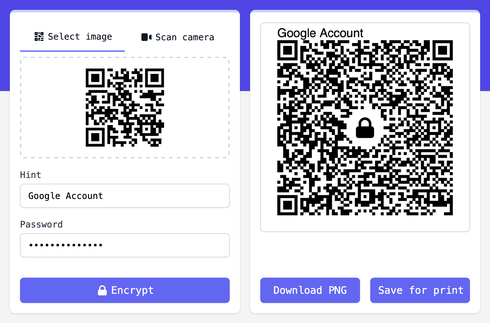

<div align="center">

# [Encrypt QR Codes](https://encrypt-qr-codes.netlify.app/)

For private two-factor auth backups.


<br/>

</div>

## Intro

A simple web app to securely encrypt and decrypt QR codes used for two-factor authentication. Safely store encrypted QR codes in your photo gallery or print them out.

- **Secure Backups:** Encrypted QR code images can be saved anywhere or printed out to recover accounts if your 2FA device is lost.
- **Privacy Focused:** No data is collected about you and all QR code scanning, encryption, and decryption is done on your device.
- **Advanced Security:** Encryption uses AES-GCM and PBKDF2 with a salted 256-bit key. View the process in Typescript or Python.
- **MIT Open Source:** Review the code and reuse it however you like. Self-host or run the site locally for fully offline encryption.

## Develop

Install and run (pnpm, yarn, and bun should work too). Access on [localhost:3000](http://localhost:3000).

```bash
npm install
npm run dev
```

Start at the landing page `app/page.tsx` and start playing. The page auto-updates as you edit the file.

## Deploy

Test, build, and run:

```bash
npm run check
npm run build
npm start
```

Or build and run with docker:

```bash
docker compose up
```

Or quickly self-host with:

[](https://app.netlify.com/start/deploy?repository=https://github.com/kangabru/encrypt-qr-codes)

## Learn More

This is a [Next.js](https://nextjs.org/) project bootstrapped with [`create-next-app`](https://github.com/vercel/next.js/tree/canary/packages/create-next-app). Here are some helpful resources to work with the project:

- [Next.js docs](https://nextjs.org/docs)
- [Tailwind CSS docs](https://tailwindcss.com/)
- [QR Scanner](https://github.com/nimiq/qr-scanner/)
- [Web Crypto API](https://developer.mozilla.org/en-US/docs/Web/API/SubtleCrypto/encrypt)

## Issues, Questions, Contributions

Feel free to open a GitHub issue to get in touch. I'm open to ideas and any feedback you might have.
